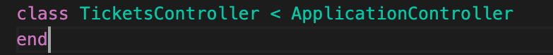
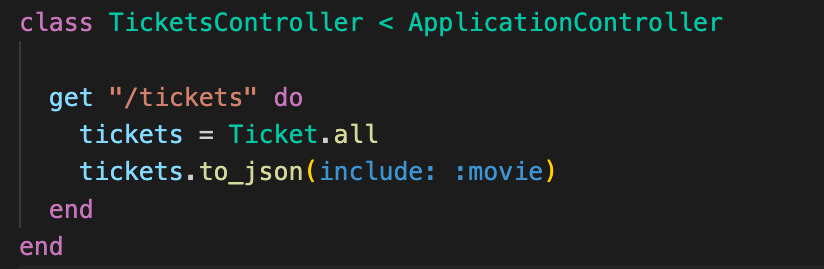
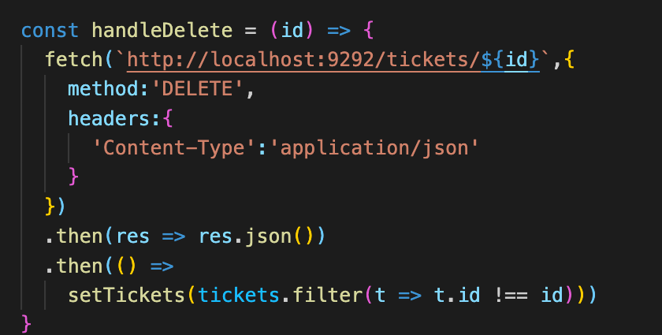

# Activity
[Clone down starter code here](https://github.com/learn-co-students/Phase-3-movie_app_101121) 

# Deliverables
Create sinatra routes 

>Note: if you get stuck review Sinatra with Active Record: GET Requests
>Note: `bundle exec rerun -b 'rackup config.ru'` will run your server.

0. Clone down the starter code and run bundle and migrate. Verify your migration was successful. Review your models to verify the associations are set up correctly. Create some seeds manually or using the faker gem.  

1. In ApplicationController create a GET route for Movies. Run your server with `bundle exec rerun -b 'rackup config.ru'` if you haven't already. Verify your route in the browser at `http://localhost:9292/movies`.
 

      

        solution 
      

      

        
      

 

  

2. Make a route for movies that dynamically displays one Movie.

      

        solution 
      

      

        
      

 

3. Practice debugging by putting a binding.pry in one of your routes. When you hit the pry check  out the params hash. 

      

        solution 
      

      

        
         
      

 

Bonus 
  4. Move the movie routes into their own controller that inherits from application controller. Mount the controller in config.ru.
  5. Make a route for tickets and display every ticket with its name and price on the browser. 

  6. Make a route for tickets that dynamically displays one ticket.
